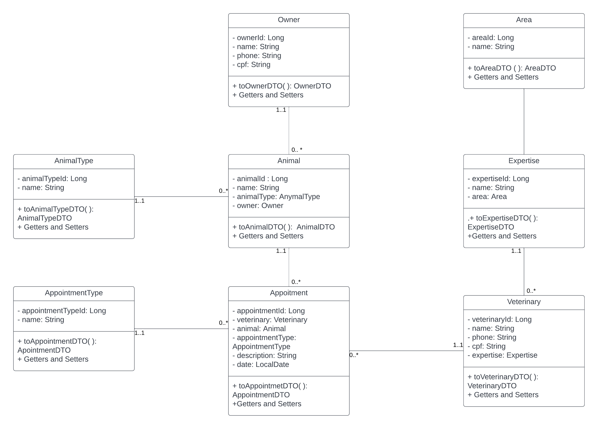
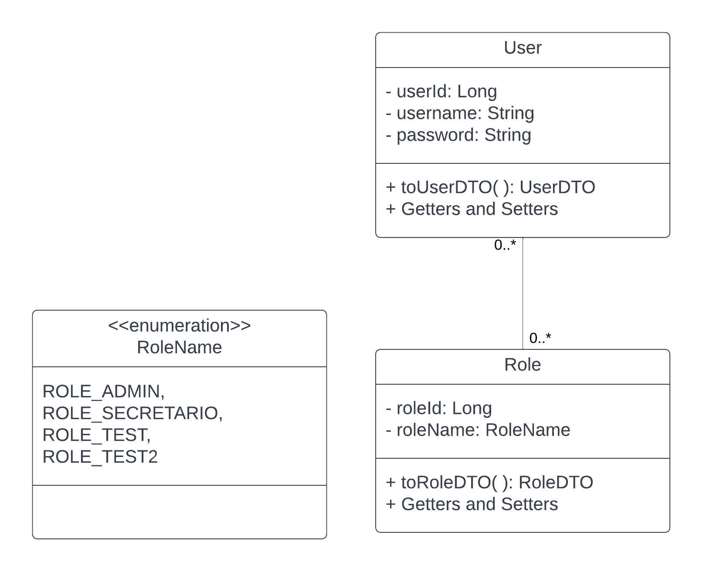
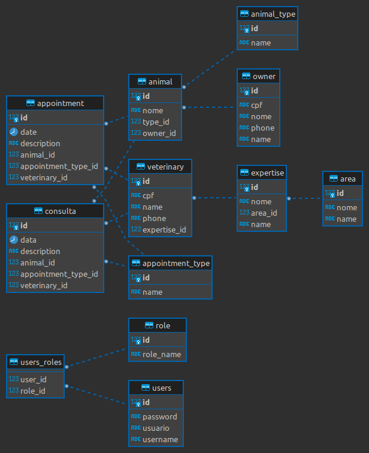

<h1 align="center">Documentation</h1>

A more extensive documentation detailing the P for Pet API.

- [Introduction](#introduction)
- [Models](#models)
- [Database](#database)
- [Repository](#repository)
- [Service](#service)
- [Controller](#controller)
  * [Basic Routes](#basic-routes)
- [Authentication](#authentication)
- [Tests](#tests)
- [TODO](#todo)
- [About Me](#about-me)

# Introduction

The P for Pet Api aims to provide CRUD operations by microservices/end-points. The idea behind the project is to help the maintenance of a Veterinary Clinic System.

The system permits CRUD operations for any of the models described in  [Models](#Models).

It's an ongoing system so many things are being updated and changed every day, but the branch `master` always have the stable version of development.

> The other branch's have features that are being developed.

<h2>Releases</h2>
The releases are on the numbered branch like `0.1`, `0.2`, `0.3`. 

# Models

The models are composed by:
* Animal
  * Represent the Pet. It has a single Owner.
* AnimalType
  * Represent the types of animals that the clinic serves.
* Appointment:
  * Represent the booked appointment of a Veterinary with Animal.
* AppointmentType
  * Represent the types of appointment that the clinic have.
* Area
  * Represent the area of actuation of the veterinary.
* Expertise
  * Represent the specialty of the veterinary inside his actuation area. Can hava one Area.
* Owner
  * Represent the owner of the animal. It can have multiple animals.
* Role
  * Represent the role of a user in the system.
* User
  * Represent the login information to authenticate in the system. Can have multiple roles.
* Veterinary
  * Represent the veterinary that will attend at the clinic. Can have one Expertise.

The models have Data Transfer Objects (DTOs):
* AnimalDTO
* AnimalTypeDTO
* AppointmentDTO
* AppointmentTypeDTO
* AreaDTO
* ExpertiseDTO
* OwnerDTO
* RoleDTO
* UserDTO
* VeterinaryDTO

You can have a better view by the class diagram:

Now the user class diagram:

# Database

I'm using postgres on port 5432 at localhost. But, you can customize the config at the resources.application.properties file.
The `spring.jpa.hibernate.ddl-auto=update` makes the tables, columns and constraints be auto-updated when the api start, if the table or column don't existe it will be created.

You can see the ER Diagram:

# Repository

Each model has a repository using the Spring Data:
* AnimalRepo
* AnimalTypeRepo
* AppointmentRepo
* AppointmentTypeRepo
* AreaRepo
* ExpertiseRepo
* OwnerRepo
* RoleRepo
* UserRepo
* VeterinaryRepo

They are interfaces marked with @Repository and extends `JpaRepository<T, ID>`. So this interfaces get all methods of the JPARepository like `findById`, `removeByID`, and others. The spring make the concrete instance of the interface. 

# Service

Each model has a service:

* AnimalService
* AnimalTypeService
* AppointmentService
* AppointmentTypeService
* AreaService
* ExpertiseService
* OwnerService
* RoleService
* UserService
* VeterinaryService

This service have some business rule verification, when a rule is violated thous verification throws a `Exception`.
The services have basic operations of CRUD.

# Controller

The controllers have the operations of the services. The controllers provide routes to the consumer, this routes need authentication (expect the authentication of user).
The  routes follow a pattern: `/api/<model>`, for example: `/api/animal`, `/api/owner`.

The save, update and findAll are done in the basic route using the HTTP methods, example:
* GET: `/api/animal`  -> findAll
* POST: `/api/animal` -> save
* PUT: `/api/animal` -> update
* DELETE: `api/animal` -> remove

But, there are more routes tha this, so it easier to do the CRUD operations: find by id, remove by id, remove by id with a feedback, update a specific field, ...
* DELETE: `/api/animal/<id>` -> removeById
* GET: `/api/animal/<id>` -> findById
* DELETE: `/api/animal/feedback/<id>` -> removeByIdWithFeedback

## Basic Routes 
You call see all routes on the swagger at http://localhost:8080/swagger-ui/#/ when start the server.
s
Pattern:  METHOD:`route -> function `

* GET: `/api/<model>` -> findAll
  * content-body: None
  * description: Return a list of \<model>DTO if all found models in the database.
* GET: `/api/<model>/<id>` -> findById
  * content-body: None
  * description: receive the id of the model in the path and search on the database.
* POST: `/api/<model>` -> save
  * content-body: Json of \<model>DTO
  * description: receive the dto, verify it fields, and save a model on the database.
* PUT: `/api/<model>` -> update
  * content-body: Json of \<model>DTO
  * description: receive the dto, verify it fields, and update the model in the database.
* DELETE: `/api/<model>` -> remove
  * content-body: Json of \<mode>DTO
  * description: receive th dto, verify it fields, and remove based on the passed info of the dto.
* DELETE: `/api/<model>/<id>` -> removeById
  * content-body: None
  * description: receive the id of the model in the path and remove on the database.
* DELETE: `/api/<model>/feedback/<id>` -> removeByIdWithFeedback
  * content-body: None
  * description: receive the id of the model in the path, remove on the database and return a json of the removed model.s

# Authentication

The authentication is done with Spring Security. All info about the authentication of the routes can be seen at the package authentication.

The users of the api have roles and define their level of access to the routes. The user can have none or many roles.

# Tests

The repositories, services and controller have unit tests done with JUnit and Mockito.
 
> The tests are being constantly updated.

# TODO

Here a list of thing there need to be done:

* Exception Handling
* Refactor Controllers
* Distributed Environment Version
* Code Review
* Refactor Tests
* Integration Tests
* Refactor the DTO Response Fields
* Change the constructor to @AllArgsConstructor
* Refactor the dates type
* Use @JsonInclude(Include.NON_NULL) in the DTOs
# About Me
I'm Levy. I'm a science computer student and develop back-end applications at my free time. I'm trying to learn need things and trying to find a job :p 

You can find me in LinkedIn: https://www.linkedin.com/in/matheus-levy/?locale=en_US
